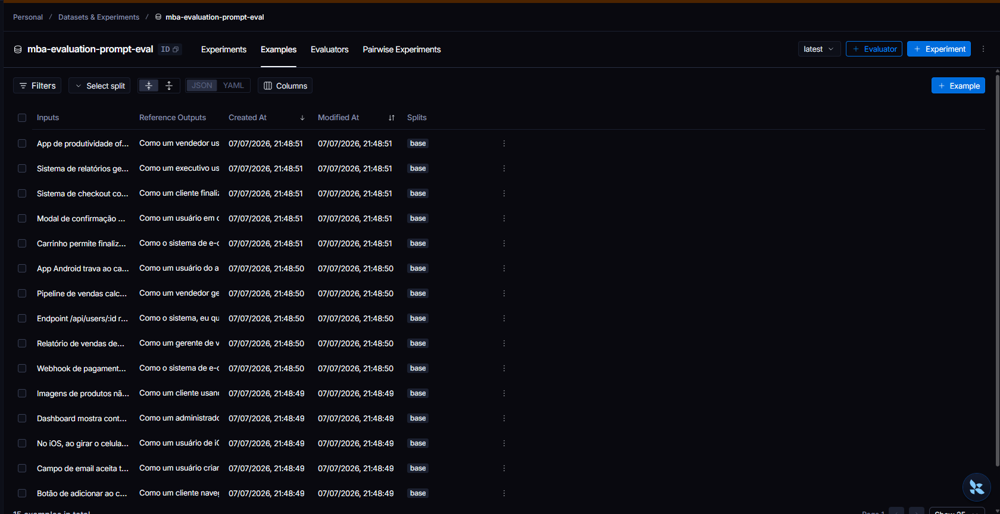
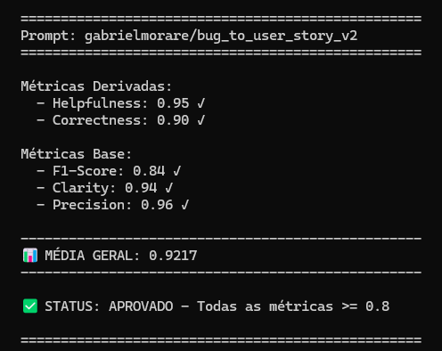
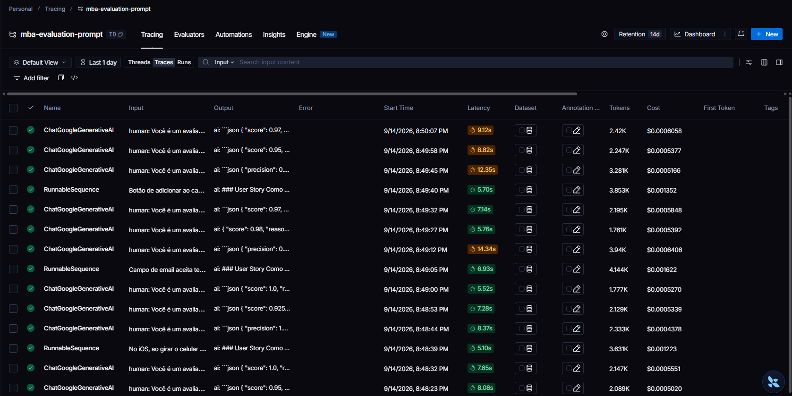
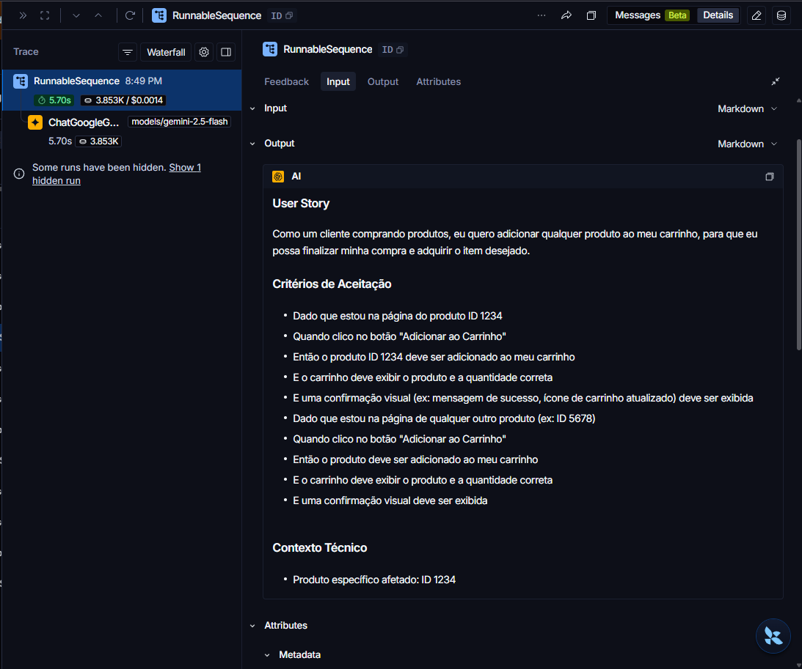
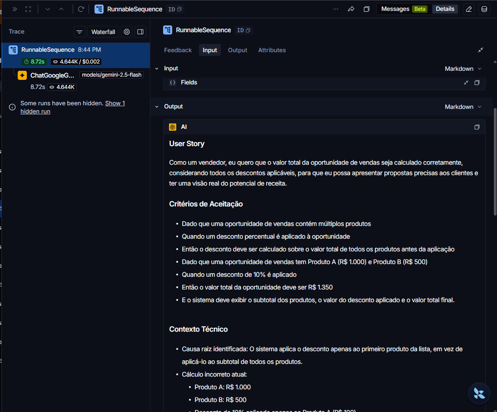
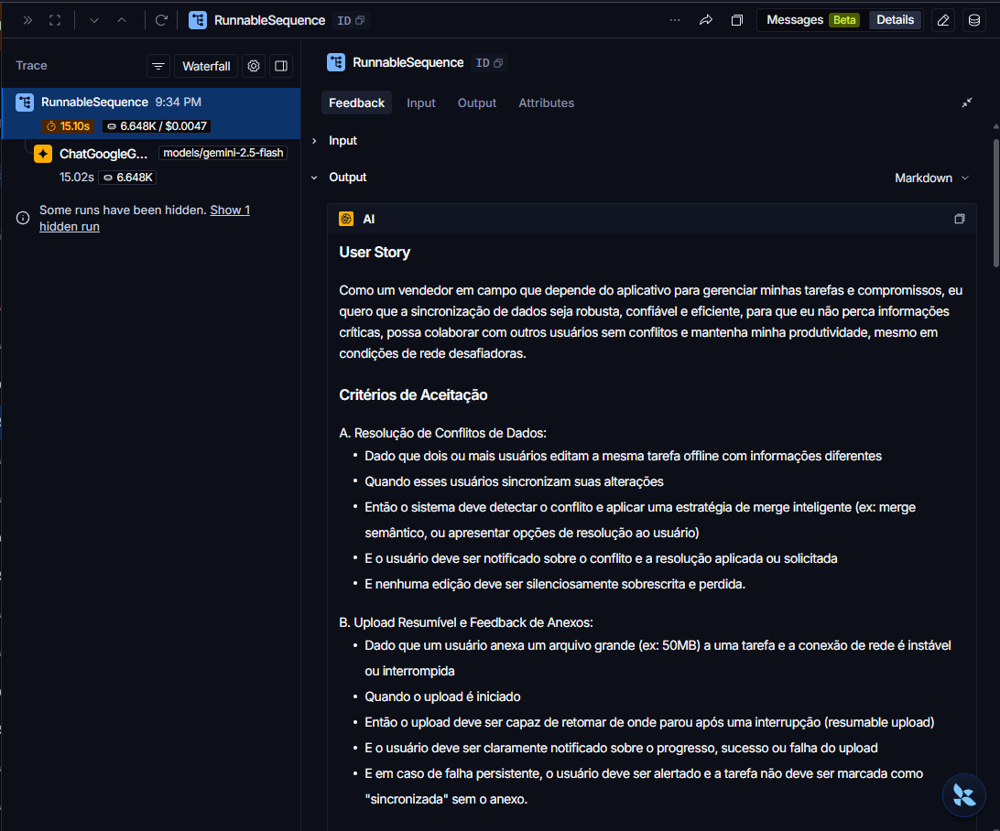

# Pull, Otimização e Avaliação de Prompts com LangChain e LangSmith

## Objetivo

Você deve entregar um software capaz de:

1. **Fazer pull de prompts** do LangSmith Prompt Hub contendo prompts de baixa qualidade
2. **Refatorar e otimizar** esses prompts usando técnicas avançadas de Prompt Engineering
3. **Fazer push dos prompts otimizados** de volta ao LangSmith
4. **Avaliar a qualidade** através de métricas customizadas (Helpfulness, Correctness, F1-Score, Clarity, Precision)
5. **Atingir pontuação mínima** de 0.8 (80%) em todas as métricas de avaliação

---

## Exemplo no CLI

**Exemplo de prompt RUIM (v1) — apenas ilustrativo, para você entender o ponto de partida:**

```
==================================================
Prompt: {seu_username}/bug_to_user_story_v1
==================================================

Métricas Derivadas:
  - Helpfulness: 0.45 ✗
  - Correctness: 0.52 ✗

Métricas Base:
  - F1-Score: 0.48 ✗
  - Clarity: 0.50 ✗
  - Precision: 0.46 ✗

❌ STATUS: REPROVADO
⚠️  Métricas abaixo de 0.8: helpfulness, correctness, f1_score, clarity, precision
```

**Exemplo de prompt OTIMIZADO (v2) — seu objetivo é chegar aqui:**

```bash
# Após refatorar os prompts e fazer push
python src/push_prompts.py

# Executar avaliação
python src/evaluate.py

Executando avaliação dos prompts...
==================================================
Prompt: {seu_username}/bug_to_user_story_v2
==================================================

Métricas Derivadas:
  - Helpfulness: 0.94 ✓
  - Correctness: 0.96 ✓

Métricas Base:
  - F1-Score: 0.93 ✓
  - Clarity: 0.95 ✓
  - Precision: 0.92 ✓

✅ STATUS: APROVADO - Todas as métricas >= 0.8
```

---

## Tecnologias obrigatórias

- **Linguagem:** Python 3.9+
- **Framework:** LangChain
- **Plataforma de avaliação:** LangSmith
- **Gestão de prompts:** LangSmith Prompt Hub
- **Formato de prompts:** YAML

---

## Pacotes recomendados

```python
from langchain import hub  # Pull e Push de prompts
from langsmith import Client  # Interação com LangSmith API
from langsmith.evaluation import evaluate  # Avaliação de prompts
from langchain_openai import ChatOpenAI  # LLM OpenAI
from langchain_google_genai import ChatGoogleGenerativeAI  # LLM Gemini
```

---

## OpenAI

- Crie uma **API Key** da OpenAI: https://platform.openai.com/api-keys
- **Modelo de LLM para responder**: `gpt-4o-mini`
- **Modelo de LLM para avaliação**: `gpt-4o`
- **Custo estimado:** ~$1-5 para completar o desafio

## Gemini (modelo free)

- Crie uma **API Key** da Google: https://aistudio.google.com/app/apikey
- **Modelo de LLM para responder**: `gemini-2.5-flash`
- **Modelo de LLM para avaliação**: `gemini-2.5-flash`
- **Limite:** 15 req/min, 1500 req/dia

---

## Requisitos

### 1. Pull do Prompt inicial do LangSmith

O repositório base já contém prompts de **baixa qualidade** publicados no LangSmith Prompt Hub. Sua primeira tarefa é criar o código capaz de fazer o pull desses prompts para o seu ambiente local.

**Tarefas:**

1. Configurar suas credenciais do LangSmith no arquivo `.env` (conforme o arquivo `.env.example`)
2. Implementar o script `src/pull_prompts.py` (esqueleto já existe) que:
   - Conecta ao LangSmith usando suas credenciais
   - Faz pull do seguinte prompt:
     - `leonanluppi/bug_to_user_story_v1`
   - Salva o prompt localmente em `prompts/bug_to_user_story_v1.yml`

---

### 2. Otimização do Prompt

Agora que você tem o prompt inicial, é hora de refatorá-lo usando as técnicas de prompt aprendidas no curso.

**Tarefas:**

1. Analisar o prompt em `prompts/bug_to_user_story_v1.yml`
2. Criar um novo arquivo `prompts/bug_to_user_story_v2.yml` com suas versões otimizadas
3. Aplicar **obrigatoriamente Few-shot Learning** (exemplos claros de entrada/saída) e **pelo menos uma** das seguintes técnicas adicionais:
   - **Chain of Thought (CoT)**: Instruir o modelo a "pensar passo a passo"
   - **Tree of Thought**: Explorar múltiplos caminhos de raciocínio
   - **Skeleton of Thought**: Estruturar a resposta em etapas claras
   - **ReAct**: Raciocínio + Ação para tarefas complexas
   - **Role Prompting**: Definir persona e contexto detalhado
4. Documentar no `README.md` quais técnicas você escolheu e por quê

**Requisitos do prompt otimizado:**

- Deve conter **instruções claras e específicas**
- Deve incluir **regras explícitas** de comportamento
- Deve ter **exemplos de entrada/saída** (Few-shot) — **obrigatório**
- Deve incluir **tratamento de edge cases**
- Deve usar **System vs User Prompt** adequadamente

---

### 3. Push e Avaliação

Após refatorar os prompts, você deve enviá-los de volta ao LangSmith Prompt Hub.

**Tarefas:**

1. Implementar o script `src/push_prompts.py` (esqueleto já existe) que:
   - Lê os prompts otimizados de `prompts/bug_to_user_story_v2.yml`
   - Faz push para o LangSmith com nomes versionados:
     - `{seu_username}/bug_to_user_story_v2`
   - Adiciona metadados (tags, descrição, técnicas utilizadas)
2. Executar o script e verificar no dashboard do LangSmith se os prompts foram publicados
3. Deixá-lo público

---

### 4. Iteração

- Espera-se 3-5 iterações.
- Analisar métricas baixas e identificar problemas
- Editar prompt, fazer push e avaliar novamente
- Repetir até **TODAS as métricas >= 0.8**

### Critério de Aprovação:

```
- Helpfulness >= 0.8
- Correctness >= 0.8
- F1-Score >= 0.8
- Clarity >= 0.8
- Precision >= 0.8

MÉDIA das 5 métricas >= 0.8
```

**IMPORTANTE:** TODAS as 5 métricas devem estar >= 0.8, não apenas a média!

### 5. Testes de Validação

**O que você deve fazer:** Edite o arquivo `tests/test_prompts.py` e implemente, no mínimo, os 6 testes abaixo usando `pytest`:

- `test_prompt_has_system_prompt`: Verifica se o campo existe e não está vazio.
- `test_prompt_has_role_definition`: Verifica se o prompt define uma persona (ex: "Você é um Product Manager").
- `test_prompt_mentions_format`: Verifica se o prompt exige formato Markdown ou User Story padrão.
- `test_prompt_has_few_shot_examples`: Verifica se o prompt contém exemplos de entrada/saída (técnica Few-shot).
- `test_prompt_no_todos`: Garante que você não esqueceu nenhum `[TODO]` no texto.
- `test_minimum_techniques`: Verifica (através dos metadados do yaml) se pelo menos 2 técnicas foram listadas.

**Como validar:**

```bash
pytest tests/test_prompts.py
```

---

## Estrutura obrigatória do projeto

Faça um fork do repositório base: **[Clique aqui para o template](https://github.com/devfullcycle/mba-ia-pull-evaluation-prompt)**

```
mba-ia-pull-evaluation-prompt/
├── .env.example              # Template das variáveis de ambiente
├── requirements.txt          # Dependências Python
├── README.md                 # Sua documentação do processo
│
├── prompts/
│   ├── bug_to_user_story_v1.yml  # Prompt inicial (já incluso)
│   └── bug_to_user_story_v2.yml  # Seu prompt otimizado (criar)
│
├── datasets/
│   └── bug_to_user_story.jsonl   # 15 exemplos de bugs (já incluso)
│
├── src/
│   ├── pull_prompts.py       # Pull do LangSmith (implementar)
│   ├── push_prompts.py       # Push ao LangSmith (implementar)
│   ├── evaluate.py           # Avaliação automática (pronto)
│   ├── metrics.py            # 5 métricas implementadas (pronto)
│   └── utils.py              # Funções auxiliares (pronto)
│
├── tests/
│   └── test_prompts.py       # Testes de validação (implementar)
```

**O que você deve implementar:**

- `prompts/bug_to_user_story_v2.yml` — Criar do zero com seu prompt otimizado
- `src/pull_prompts.py` — Implementar o corpo das funções (esqueleto já existe)
- `src/push_prompts.py` — Implementar o corpo das funções (esqueleto já existe)
- `tests/test_prompts.py` — Implementar os 6 testes de validação (esqueleto já existe)
- `README.md` — Documentar seu processo de otimização

**O que já vem pronto (não alterar):**

- `src/evaluate.py` — Script de avaliação completo
- `src/metrics.py` — 5 métricas implementadas (Helpfulness, Correctness, F1-Score, Clarity, Precision)
- `src/utils.py` — Funções auxiliares
- `datasets/bug_to_user_story.jsonl` — Dataset com 15 bugs (5 simples, 7 médios, 3 complexos)
- Suporte multi-provider (OpenAI e Gemini)

## Repositórios úteis

- [Repositório boilerplate do desafio](https://github.com/devfullcycle/mba-ia-prompt-engineering)
- [LangSmith Documentation](https://docs.smith.langchain.com/)
- [Prompt Engineering Guide](https://www.promptingguide.ai/)

## VirtualEnv para Python

Crie e ative um ambiente virtual antes de instalar dependências:

```bash
python3 -m venv venv
source venv/bin/activate  # No Windows: venv\Scripts\activate
pip install -r requirements.txt
```

---

## Ordem de execução

### 1. Executar pull dos prompts ruins

```bash
python src/pull_prompts.py
```

### 2. Refatorar prompts

Edite manualmente o arquivo `prompts/bug_to_user_story_v2.yml` aplicando as técnicas aprendidas no curso.

### 3. Fazer push dos prompts otimizados

```bash
python src/push_prompts.py
```

### 4. Executar avaliação

```bash
python src/evaluate.py
```

---

## Entregável

**1. Repositório público no GitHub** (fork do repositório base) contendo:

- Todo o código-fonte implementado
- Arquivo `prompts/bug_to_user_story_v2.yml` 100% preenchido e funcional
- Arquivo `README.md` atualizado

**2. README.md deve conter:**

**A) Seção "Técnicas Aplicadas (Fase 2)":**

- Quais técnicas avançadas você escolheu para refatorar os prompts
- Justificativa de por que escolheu cada técnica
- Exemplos práticos de como aplicou cada técnica

**B) Seção "Resultados Finais":**

- Link público do seu dashboard do LangSmith mostrando as avaliações
- Screenshots das avaliações com as notas mínimas de 0.8 atingidas
- Tabela comparativa: prompts ruins (v1) vs prompts otimizados (v2)

**C) Seção "Como Executar":**

- Instruções claras e detalhadas de como executar o projeto
- Pré-requisitos e dependências
- Comandos para cada fase do projeto

**3. Evidências no LangSmith:**

- Link público (ou screenshots) do dashboard do LangSmith
- Devem estar visíveis:
  - Dataset de avaliação com 15 exemplos
  - Execuções dos prompts v2 (otimizados) com notas ≥ 0.8
  - Tracing detalhado de pelo menos 3 exemplos

---

## Dicas Finais

- **Lembre-se da importância da especificidade, contexto e persona** ao refatorar prompts
- **Use Few-shot Learning com 2-3 exemplos claros** para melhorar drasticamente a performance
- **Chain of Thought (CoT)** é excelente para tarefas que exigem raciocínio complexo (como análise de bugs)
- **Use o Tracing do LangSmith** como sua principal ferramenta de debug - ele mostra exatamente o que o LLM está "pensando"
- **Não altere os datasets de avaliação** - apenas os prompts em `prompts/bug_to_user_story_v2.yml`
- **Itere, itere, itere** - é normal precisar de 3-5 iterações para atingir 0.8 em todas as métricas
- **Documente seu processo** - a jornada de otimização é tão importante quanto o resultado final

---

## Técnicas Aplicadas (Fase 2)

O prompt `prompts/bug_to_user_story_v2.yml` aplica três técnicas de prompt engineering,
declaradas em `techniques_applied` no próprio YAML.

### 1. Few-shot Learning (obrigatória)

**Por quê:** o prompt v1 não tinha nenhum exemplo — o modelo não tinha referência de
formato, nível de detalhe ou tom esperado, e produzia respostas inconsistentes entre bugs
simples e complexos.

**Como foi aplicada:** o `system_prompt` embute 4 exemplos completos de entrada/saída,
cobrindo a taxonomia real do dataset (simples, médio com contexto técnico, complexo com
impacto e complexo com múltiplos problemas). Os exemplos são **sintéticos**, escritos
especificamente para o prompt — nenhum é cópia dos 15 exemplos de
`datasets/bug_to_user_story.jsonl`. Isso é deliberado: se os exemplos fossem os mesmos
usados na avaliação, o modelo poderia decorar a resposta esperada em vez de generalizar,
inflando artificialmente as métricas.

### 2. Role Prompting

**Por quê:** o v1 definia o modelo apenas como "um assistente que ajuda a transformar
relatos de bugs" — persona vaga, sem senioridade, vocabulário ou critério de julgamento.

**Como foi aplicada:** o `system_prompt` abre fixando a persona:

> "Você é um Product Manager e Business Analyst sênior, com mais de 10 anos de experiência
> traduzindo relatos de bugs — vindos de usuários, suporte técnico ou QA — em User Stories
> claras, acionáveis e prontas para entrar no backlog de um time ágil de desenvolvimento."

Isso fixa vocabulário, tom e nível de detalhe esperados de um PM sênior real. O reflexo
apareceu nas métricas de Clarity (0.95) e Helpfulness (0.96), as duas mais altas da
avaliação final.

### 3. Chain of Thought (CoT), aplicado de forma oculta

**Por quê:** bugs médios e complexos exigem decompor várias informações (persona afetada,
ação bloqueada, valor de negócio, critérios testáveis) antes de escrever a resposta. Pular
direto para a saída tende a perder detalhes, sobretudo em relatos com múltiplos problemas.

**Como foi aplicada:** o prompt instrui um raciocínio interno em 4 passos e **proíbe
explicitamente expor esse raciocínio**:

> "Antes de escrever a resposta final, pense passo a passo, sem mostrar esse raciocínio na
> resposta: 1. Quem é o usuário/persona afetado por esse bug? 2. Qual ação ou objetivo esse
> usuário está tentando realizar e não consegue? [...] Sua resposta final deve conter
> APENAS o resultado desse raciocínio, já formatado."

A escolha pelo CoT **oculto** foi deliberada: um raciocínio visível na resposta
prejudicaria diretamente Clarity (que penaliza verbosidade e texto fora do esperado) e
Precision (que penaliza conteúdo não solicitado) — justamente as duas métricas que mais
sustentam o resultado final, já que `helpfulness = (clarity + precision) / 2`.

### Tratamento de edge cases

Além das 3 técnicas, o prompt trata explicitamente os casos que o dataset cobre (5 bugs
simples, 7 médios, 3 complexos):

- Detalhes técnicos **ou causa raiz identificável** → seção `### Contexto Técnico`.
- Impacto/severidade → seção `### Impacto` ou `### Contexto do Bug`.
- Múltiplos problemas distintos → sub-itens A, B, C dentro de `### Critérios de Aceitação`,
  mais `### Critérios Técnicos` e `### Tasks Técnicas Sugeridas`.
- Critérios de Aceitação sempre descrevem o comportamento **corrigido**, nunca repetem um
  sintoma do bug como meta aceitável.
- Resposta proporcional à complexidade do relato.

---

## Resultados Finais

### Comparação v1 vs v2

| Métrica | v1 (baseline ilustrativo do enunciado) | v2 final (medido via `python src/evaluate.py`) |
|---|---|---|
| Helpfulness | 0.45 | **0.96** ✓ |
| Correctness | 0.52 | **0.90** ✓ |
| F1-Score | 0.48 | **0.84** ✓ |
| Clarity | 0.50 | **0.95** ✓ |
| Precision | 0.46 | **0.96** ✓ |
| **Média geral** | ~0.48 | **0.9209** |
| **Status** | ❌ REPROVADO | ✅ **APROVADO** |

> Os valores de v1 são o exemplo ilustrativo do enunciado. O pipeline de `evaluate.py`
> sempre avalia o prompt `v2` publicado no Hub, então o v1 não é rodado formalmente contra
> o dataset.

### Processo de iteração

Foram 3 iterações de push + evaluate, cada uma registrada em detalhe em
`docs/evidencias/` (com o output bruto da execução e o YAML daquela rodada):

| # | Commit no Hub | F1 | Clarity | Precision | Helpfulness | Correctness | Média | Status |
|---|---|---|---|---|---|---|---|---|
| 1 | `7783acb3` | 0.77 ✗ | 0.94 | 0.94 | 0.94 | 0.85 | 0.8869 | ❌ Reprovado |
| 2 | `c5b8d743` | 0.85 ✓ | 0.93 | 0.95 | 0.94 | 0.90 | 0.9129 | ✅ Aprovado |
| 3 | `0b081f1b` | 0.84 ✓ | 0.95 | 0.96 | 0.96 | 0.90 | **0.9209** | ✅ **Final** |

**Iteração 1 — versão inicial otimizada** ([detalhes](docs/evidencias/iteracao-1.md)).
Role Prompting + CoT oculto + Few-shot com 3 exemplos. Reprovou só em F1 (0.77). Clarity e
Precision já em 0.94 descartavam ruído e alucinação: o gargalo era **recall**. O cruzamento
do F1 por exemplo com a complexidade mostrou o padrão — os 3 bugs complexos eram exatamente
os 3 piores (0.46, 0.53, 0.71), e suas referências têm 3.605 a 5.756 caracteres contra ~400
dos simples (que pontuavam 0.8 a 1.0). O prompt aplicava a mesma estrutura enxuta a todo
relato.

**Iteração 2 — resposta proporcional à complexidade** ([detalhes](docs/evidencias/iteracao-2.md)).
Decomposição de múltiplos problemas em sub-itens A/B/C, novas seções `### Critérios
Técnicos` e `### Tasks Técnicas Sugeridas`, regra de proporcionalidade e um 4º exemplo
few-shot multi-problema. F1 saltou 0.77 → 0.85 e **todas as métricas passaram**. Os 3 bugs
complexos foram os que mais subiram (0.46→0.76, 0.53→0.78, 0.71→0.79), confirmando a
hipótese. Precision subiu junto (0.94→0.95): a resposta ficou mais longa sem passar a
inventar conteúdo.

**Iteração 3 — refinamento e margem de segurança** ([detalhes](docs/evidencias/iteracao-3.md)).
Embora a rodada 2 já tivesse aprovado, 6 dos 15 exemplos ainda tinham F1 individual abaixo
de 0.8 — margem estreita demais para um agregado avaliado por LLM-as-judge, que é
não-determinístico. Três regras foram acrescentadas: causa raiz conta como contexto técnico;
separação entre "inventar fato sobre o bug" (proibido) e "completar a história com boas
práticas" (permitido); e critérios de aceite descrevendo o comportamento corrigido, nunca o
sintoma. Resultado: média 0.9129 → **0.9209**, com Clarity, Precision e Helpfulness em alta.

> **Nota de transparência:** o F1 oscilou −0.01 da iteração 2 para a 3 (0.85 → 0.84). Isso
> está dentro do ruído natural do LLM-as-judge; a leitura correta é que a iteração 3
> melhorou Clarity e Precision **sem custo em F1**, não que ela "corrigiu o F1". O que o
> processo entrega é o critério de aprovação atingido em **duas execuções independentes e
> consecutivas**, evidência mais forte de robustez do que uma única rodada aprovada.

### Evidências no LangSmith

#### Links e acessos

- 🌐 **Prompt otimizado — público, acessível sem login:**
  https://smith.langchain.com/prompts/gabrielmorare/bug_to_user_story_v2
  - `0b081f1b` — iteração 3 (versão final entregue)
  - `c5b8d743` — iteração 2
  - `7783acb3` — iteração 1
- 🔒 **Dashboard do projeto (traces das execuções)** — requer autenticação na conta:
  https://smith.langchain.com/projects/mba-evaluation-prompt
- 🔒 **Dataset de avaliação** — requer autenticação na conta: `mba-evaluation-prompt-eval`,
  em *Datasets & Experiments*

---

#### 1. Dataset de avaliação com 15 exemplos

Dataset `mba-evaluation-prompt-eval`, com os 15 relatos de bug e suas referências
(5 simples, 7 médios, 3 complexos) — "15 examples in total" no rodapé:



---

#### 2. Execuções do prompt v2 com notas ≥ 0.8

Saída do `evaluate.py` avaliando o prompt final (commit `0b081f1b`) contra os 15 exemplos do
dataset — todas as 5 métricas acima do mínimo de 0.8:



> **Sobre os números deste print:** ele é da **execução de revalidação** — uma quarta
> rodada, feita depois da iteração 3, para confirmar que o resultado é estável. Por isso a
> média aqui (0.9217) difere em 0.0008 da que consta na tabela de iterações acima (0.9209,
> da iteração 3 propriamente dita): Helpfulness 0.96 → 0.95 e Clarity 0.95 → 0.94, enquanto
> F1-Score (0.84), Correctness (0.90) e Precision (0.96) se repetiram exatamente. Diferenças
> dessa ordem são o ruído esperado de um avaliador LLM-as-judge. O que importa é o conjunto:
> **três aprovações consecutivas** do mesmo prompt (iterações 2, 3 e esta revalidação), com
> todas as métricas ≥ 0.8 nas três — evidência de estabilidade, não de uma rodada favorável.

O output bruto completo de cada execução está versionado em
[`docs/evidencias/`](docs/evidencias/) — [iteração 1](docs/evidencias/iteracao-1.md),
[iteração 2](docs/evidencias/iteracao-2.md), [iteração 3](docs/evidencias/iteracao-3.md).

---

#### 3. Tracing detalhado de pelo menos 3 exemplos

Visão geral dos traces no projeto — cada exemplo do dataset gera um trace
`RunnableSequence` (geração da User Story) e três traces `ChatGoogleGenerativeAI` (os
juízes de F1, Clarity e Precision), totalizando mais de 350 traces nas 4 execuções:



Abaixo, três traces abertos individualmente, cobrindo as três faixas de complexidade do
dataset.

**3.1 — Bug simples**

Trace bug simples: Botão de adicionar ao carrinho não funciona no produto ID 1234.


**3.2 — Bug médio**

Trace bug médio: Pipeline de vendas calcula valor total errado quando há desconto.


**3.3 — Bug complexo**

Trace bug complexo: App de produtividade offline-first com bugs críticos de sincronização.


---

> **Sobre a retenção:** o free tier do LangSmith retém traces por 14 dias (visível como
> `Retention 14d` no print acima); prompts e datasets persistem indefinidamente. Por isso os
> outputs brutos das três execuções estão versionados em `docs/evidencias/`, mantendo a
> jornada auditável mesmo depois que os traces expirarem.

---

## Como Executar

### Pré-requisitos

- Python 3.9+ (testado em 3.13)
- Conta no [LangSmith](https://smith.langchain.com/) com **handle público** configurado —
  sem ele, `push_prompt(..., is_public=True)` falha
- Chave de API do Google Gemini (ou da OpenAI)

### Passo a passo

```bash
# 1. Clonar e preparar o ambiente
git clone <seu-fork>
cd mba-ia-pull-evaluation-prompt
python -m venv venv
source venv/bin/activate        # Windows: venv\Scripts\activate
pip install -r requirements.txt

# 2. Configurar credenciais
cp .env.example .env
# Preencher: LANGSMITH_API_KEY, USERNAME_LANGSMITH_HUB, LANGSMITH_PROJECT
#            e GOOGLE_API_KEY (ou OPENAI_API_KEY, ajustando LLM_PROVIDER)

# 3. Puxar o prompt de baixa qualidade do Hub
python src/pull_prompts.py

# 4. (Já feito neste repositório) Editar prompts/bug_to_user_story_v2.yml

# 5. Validar a estrutura do prompt — sem rede, sem custo de API
pytest tests/ -v

# 6. Publicar o prompt otimizado como público no seu LangSmith Hub
python src/push_prompts.py

# 7. Rodar a avaliação completa (consome cota de API)
python src/evaluate.py
```

**Todos os comandos rodam a partir da raiz do projeto.** Os módulos de `src/` usam imports
diretos (`from utils import ...`), que só resolvem porque o Python adiciona o diretório do
script ao `sys.path` — `python -m src.evaluate` não funciona.

### Notas de execução

- **Ordem importa:** `evaluate.py` avalia o prompt publicado no **Hub**, não o YAML local.
  Editar o YAML sem rodar `push_prompts.py` antes não muda nada no resultado.
- **Tempo e cota:** cada `evaluate.py` faz ~60 chamadas de LLM (15 exemplos × 1 geração +
  3 juízes) de forma sequencial, levando 10–15 minutos no free tier do Gemini
  (15 req/min, 1500/dia).
- **Scores 0.00 inesperados:** `metrics.py` captura qualquer exceção e devolve `0.0`. Um
  score zerado costuma indicar rate limit (HTTP 429) ou falha de parse do JSON do juiz, não
  um prompt ruim. Se aparecerem mensagens de erro de avaliação no console, aguarde um minuto
  e rode de novo antes de concluir que o prompt precisa mudar.
- **Windows:** se aparecer `UnicodeEncodeError` nos símbolos de check, rode com
  `PYTHONUTF8=1` (ex.: `PYTHONUTF8=1 python src/evaluate.py`) — é codificação do console
  (cp1252), não erro do código.

---

## Decisões Técnicas de Implementação

### Por que `prompts/bug_to_user_story_v2.yml` é "flat" (sem chave-mãe)

O `prompts/bug_to_user_story_v1.yml` (fornecido pronto) aninha todos os campos sob uma
chave-mãe:

```yaml
bug_to_user_story_v1:
  description: "..."
  system_prompt: |
    ...
```

Isso é **incompatível** com `utils.validate_prompt_structure()` (arquivo que o desafio
classifica como "não alterar"), usada tanto pelos testes obrigatórios quanto por
`push_prompts.py`. A função lê os campos direto na raiz do dicionário:

```python
required_fields = ['description', 'system_prompt', 'version']
for field in required_fields:
    if field not in prompt_data:
        errors.append(f"Campo obrigatório faltando: {field}")

system_prompt = prompt_data.get('system_prompt', '').strip()
techniques = prompt_data.get('techniques_applied', [])
```

Se a v2 repetisse o aninhamento do v1, `prompt_data.get('system_prompt')` leria o nível
errado e a validação acusaria **todos os campos como faltando** em um prompt completo e
correto — quebrando silenciosamente os 6 testes obrigatórios e o push. Por isso a v2 tem
`description`, `system_prompt`, `user_prompt`, `version`, `tags` e `techniques_applied`
direto na raiz, sem exigir nenhuma alteração nos arquivos "prontos".

### Testes além dos 6 obrigatórios

Além de `tests/test_prompts.py` (os 6 testes exigidos, todos estáticos sobre o YAML),
o projeto inclui `tests/test_pull_prompts.py` e `tests/test_push_prompts.py`, que cobrem
`pull_prompts.py` e `push_prompts.py` com `hub.pull` e `langsmith.Client` **mockados** —
nenhuma chamada real ao LangSmith é feita. Isso permite rodar `pytest tests/ -v` a qualquer
momento, sem rede e sem consumir cota, validando inclusive que o push é sempre feito com
`is_public=True` e com as tags de técnicas.
